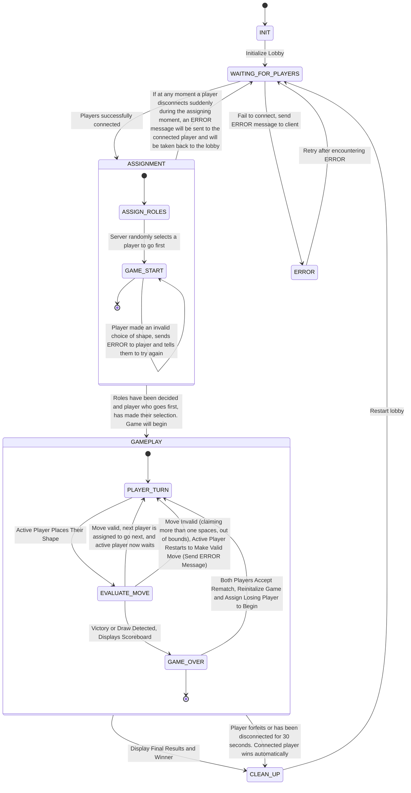

```mermaid
stateDiagram-v2
    [*] --> INIT
    INIT --> WAITING_FOR_PLAYERS : Initialize Lobby
    WAITING_FOR_PLAYERS --> ASSIGNMENT : Players successfully connected
    WAITING_FOR_PLAYERS --> ERROR : Fail to connect, send ERROR message to client
    ERROR --> WAITING_FOR_PLAYERS : Retry after encountering ERROR
    GAMEPLAY --> CLEAN_UP : Display Final Results and Winner
    GAMEPLAY --> CLEAN_UP : Player forfeits or has been disconnected for 30 seconds. Connected player wins automatically
    CLEAN_UP --> WAITING_FOR_PLAYERS : Restart lobby

    state ASSIGNMENT {
        [*] --> ASSIGN_ROLES
        ASSIGN_ROLES --> GAME_START : Server randomly selects a player to go first
        GAME_START --> [*]
        GAME_START --> GAME_START : Player made an invalid choice of shape, sends ERROR to player and tells them to try again
    }
    ASSIGNMENT --> GAMEPLAY : Roles have been decided and player who goes first, has made their selection. Game will begin
    ASSIGNMENT --> WAITING_FOR_PLAYERS : If at any moment a player disconnects suddenly during the assigning moment, an ERROR message will be sent to the connected player and will be taken back to the lobby
    state GAMEPLAY {
        [*] --> PLAYER_TURN
        PLAYER_TURN --> EVALUATE_MOVE : Active Player Places Their Shape
        EVALUATE_MOVE --> PLAYER_TURN : Move valid, next player is assigned to go next, and active player now waits
        EVALUATE_MOVE --> PLAYER_TURN : Move Invalid (claiming more than one spaces, out of bounds), Active Player Restarts to Make Valid Move (Send ERROR Message)
        EVALUATE_MOVE --> GAME_OVER : Victory or Draw Detected, Displays Scoreboard
        GAME_OVER --> PLAYER_TURN : Both Players Accept Rematch, Reinitalize Game and Assign Losing Player to Begin
        GAME_OVER --> [*]
    }
```
